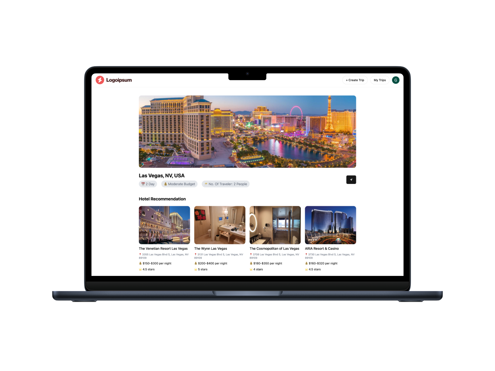

# 🌍 TravelBuddy - AI Trip Planner ✈️

TravelBuddy is an AI-powered trip planner built with **React**, **Tailwind CSS**, **ShadCN UI**, **Firebase**, and **Google Gemini API**. It allows users to generate custom travel itineraries based on trip details such as destination, duration, budget, and number of travelers. It also provides hotel suggestions and stores past trips securely.



---

## 🚀 Features

- ✅ **User Trip Input**: Users can input their trip details like location, days, budget, and number of travelers.
- 🧠 **AI-Powered Itinerary**: Uses Google Gemini API to generate a day-by-day itinerary based on user input.
- 🏨 **Hotel Suggestions**: Shows hotel options for the selected destination.
- 🔐 **Google Authentication**: Secure sign-in with Google using Firebase Auth.
- ☁️ **Trip Storage**: Saves all trip data to Firebase Firestore for easy access.
- 💅 **Modern UI**: Built using Tailwind CSS and ShadCN component library for a clean and responsive UI.
- 📷 **Place Image Fetching**: Integrates with Google Place API to show location-based images.

---

## 🧪 Technologies Used

- **React**
- **Tailwind CSS**
- **ShadCN UI**
- **Firebase (Firestore)**
- **Google Gemini API**
- **Google Places API**

---

## 📦 Installation

Follow these steps to run the project locally:

### 1. Clone the Repository

```bash
git clone https://github.com/AyushAgrawal123/TravelBuddy---AI-Trip-Planner.git
cd travelbuddy
npm install


Create a .env file in the root of your project and paste:

VITE_GOOGLE_PLACE_API_KEY=your_place_api_key
VITE_GEMINI_API_KEY=your_gemini_api_key
VITE_GOOGLE_AUTH_CLIENT_ID=your_google_auth_client_id

Replace your_*_key with actual values.

Start the Development Server
npm run dev
The app should now be running at http://localhost:5173

```
